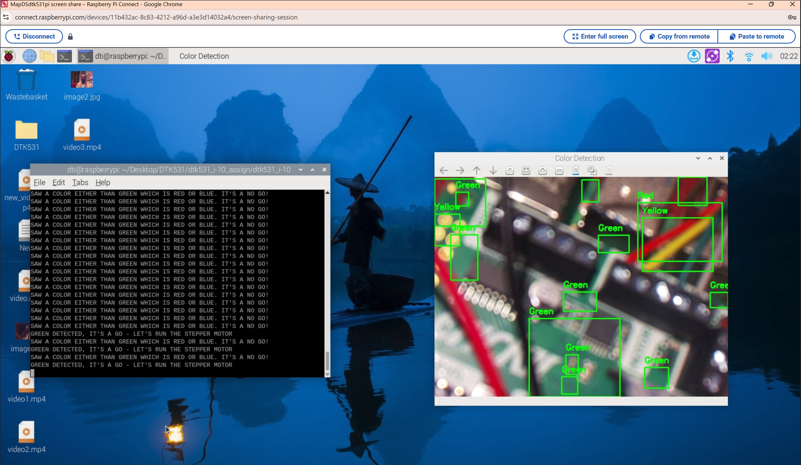

# **Color Detection with LED and Stepper Motor Control**

This project uses a Raspberry Pi camera to detect colors in real-time and controls an LED and stepper motor via the Adafruit Crickit HAT. It performs the following actions:
- Green detection: Prints "GREEN DETECTED, IT'S A GO - LET'S RUN THE STEPPER MOTOR", blinks an LED 3 times (0.5s intervals), and simultaneously runs a stepper motor for one revolution.
- Red or Blue detection: Prints "SAW A COLOR EITHER THAN GREEN WHICH IS RED OR BLUE".

## Hardware Requirements
- Raspberry Pi (with Raspberry Pi OS)
- Raspberry Pi Camera Module
- Adafruit Crickit HAT
- LED connected to `SIGNAL1` on the Crickit HAT
- Stepper motor connected to the `MOTOR` section of the Crickit HAT

## Setup Instructions

### 1. Install System Dependencies
Ensure your Raspberry Pi is updated and install the required system dependency for the Crickit library and any necessay ones:

```bash
sudo apt update
```

### 2. Install Python Dependencies
Install the required Python packages using the provided `requirements.txt`:

```bash
pip install -r requirements.txt
```

### 3. Connect Hardware
- Attach the Raspberry Pi Camera Module to your Raspberry Pi.
- Connect the Crickit HAT to the Raspberry Pi.
- Attach an LED to the `SIGNAL1` pin on the Crickit HAT.
- Connect a stepper motor to the `MOTOR` section of the Crickit HAT.

### 4. Run the Script
Execute the script to start color detection:

```bash
python color_led+motor_effect.py
```

- A window will display the camera feed with color detection overlays (rectangles and labels around detected colors).
- Hold a green object to see the LED blink, motor run, and a message printed.
- Hold a red or blue object to see a message printed.
- Press 'q' to quit.

## Logic Explanation

The script processes each frame from the camera, detects colors using HSV color space, and triggers actions based on the detected colors. Below are the key conditions and their implementations:

### 1. Green Detection
When green is detected (contour area > 500 pixels):
- Prints "GREEN DETECTED, IT'S A GO - LET'S RUN THE STEPPER MOTOR".
- Blinks the LED 3 times (0.25s ON, 0.5s OFF per blink, total ~2.25 seconds).
- Simultaneously runs the stepper motor for one full revolution (200 steps, ~2 seconds).

**Code Snippet:**
```python
if green_detected:
    print("GREEN DETECTED, IT'S A GO - LET'S RUN THE STEPPER MOTOR")
    # Create threads for blinking LED and running motor
    blink_thread = threading.Thread(target=blink_led)
    motor_thread = threading.Thread(target=run_motor)
    # Start both threads to run simultaneously
    blink_thread.start()
    motor_thread.start()
    # Wait for both threads to complete
    blink_thread.join()
    motor_thread.join()
```

**Functions Used:**
- `blink_led()`: Controls the LED blinking.
- `run_motor()`: Runs the stepper motor.

### 2. Red or Blue Detection
When red or blue is detected (contour area > 500 pixels):
- Prints "SAW A COLOR EITHER THAN GREEN WHICH IS RED OR BLUE".

**Code Snippet:**
```python
if red_or_blue_detected:
    print("SAW A COLOR EITHER THAN GREEN WHICH IS RED OR BLUE")
```

### Color Detection Logic
The script converts frames to HSV, applies color masks, and finds contours to detect colors. Flags (`green_detected`, `red_or_blue_detected`) track detections in each frame.

**Code Snippet:**
```python
for color_name, (lower, upper) in color_ranges.items():
    lower_np = np.array(lower)
    upper_np = np.array(upper)
    mask = cv2.inRange(hsv, lower_np, upper_np)
    contours, _ = cv2.findContours(mask, cv2.RETR_TREE, cv2.CHAIN_APPROX_SIMPLE)
    for cnt in contours:
        area = cv2.contourArea(cnt)
        if area > 500:  # Filter out small blobs
            x, y, w, h = cv2.boundingRect(cnt)
            cv2.rectangle(frame, (x, y), (x + w, y + h), (0, 255, 0), 2)
            cv2.putText(frame, color_name, (x, y - 10), cv2.FONT_HERSHEY_SIMPLEX,
                        0.6, (0, 255, 0), 2)
            if color_name == "Green":
                green_detected = True
            elif color_name in ["Red", "Blue"]:
                red_or_blue_detected = True
```

## Evidence of Result

### Condition 1 - Green Being Detected
`A screenshot of the camera feed showing a green colored (Raspeberry Pi itself) object with a rectangle labeled "Green" around it. The console shows "GREEN DETECTED, IT'S A GO - LET'S RUN THE STEPPER MOTOR"`



### Condition 2 - A Color Either Than Green (Red or Blue)
`A screenshot of the camera feed showing a red or blue object with a rectangle labeled "Red" or "Blue" around it. The console shows "SAW A COLOR EITHER THAN GREEN WHICH IS RED OR BLUE"`


## Notes
- The LED blinking and motor running for green detection run simultaneously, taking ~2.25 seconds (the longer of the two durations).

## Requirements.txt

- picamera2
- opencv-python
- adafruit-circuitpython-crickit
- adafruit-circuitpython-motor

---

## References
- **[Grok AI](https://grok.com/)**: Grok AI supported me in refining my I-8 assignment and color_detection.py code provided by Matt resulting in bringing my logic to life.

---

📚 **Author of Notebook:** Michael Dankwah Agyeman-Prempeh [MEng. DTI '25]```

```